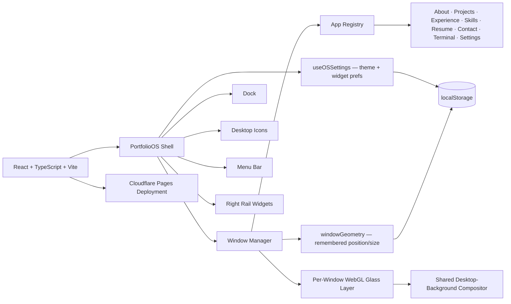

# 🖥️ AR/OS — A Desktop-Style Portfolio Operating System

A portfolio site that doesn't look like a portfolio site — it's a fully interactive, browser-based desktop OS. Windows drag, resize from eight handles, minimize/maximize/restore with real animation, remember their own size and position, and reflow their content based on their *own* width, not the browser's. Traditional "sections" (About, Projects, Experience, Skills, Resume, Contact) are windowed apps you open from a Dock or desktop icons, alongside a fully working Terminal and a Settings app that actually does something.

> I build production-ready software across backend systems, AI, cloud infrastructure, and everything in between — this project is the same instinct applied to a portfolio: not a template, an interface.

## 📌 Project Overview

Most developer portfolios are a single scrolling page. RI/OS is instead a small, self-contained operating-system simulation: a menu bar, a dock, desktop icons, draggable/resizable windows, light/dark/system theming, and a right-rail of live widgets (LinkedIn activity, tips, shortcuts, a calendar) — all built from scratch in React, with no OS-simulation library underneath.

Every "app" (About, Projects, Experience, Skills, Resume, Contact, Terminal, Settings) is a real, independent component rendered inside the window manager, and every visual surface — window chrome, the dock, the widget rail — uses a genuine glassmorphism material system, including a real-time WebGL shader layer for optical lens distortion and chromatic aberration, not just a CSS blur.

## 🏗 System Architecture

## ⚙️ Tech Stack

| Layer | Choices |
|---|---|
| **UI** | React 18, TypeScript, Vite |
| **Styling** | Custom CSS design-token system (`--os-*` variables), CSS Container Queries for per-window responsive layout, `backdrop-filter` glassmorphism |
| **Graphics** | WebGL2 with hand-written GLSL — real-time lens distortion, edge-only chromatic aberration, and variable Gaussian blur |
| **State & persistence** | React hooks + Context (`useOSSettings`), `localStorage` for theme, widget visibility, and per-app window geometry |
| **Deployment** | Cloudflare Pages/Workers via `wrangler` |

## 🪟 The Apps

| App | What it is |
|---|---|
| **About Me** | Bio, education, and a live-data skills summary, laid out editorial-style |
| **Projects** | Featured + archived project grid with a detail view per project |
| **Experience** | Work/leadership timeline with highlights per role |
| **Skills** | Full skill set grouped by category (languages, AI/ML, backend, cloud, etc.) |
| **Resume** | In-window PDF preview with a download fallback |
| **Contact** | Real contact links (email, GitHub, LinkedIn) with one-tap copy |
| **Terminal** | An actual interactive shell — typed commands, ↑/↓ history, a real command table (`help`, `open <app>`, `whoami`, `date`, `clear`, …) that drives the OS |
| **Settings** | Appearance (light/dark/system), widget visibility, and "remember window positions" — all persisted |

## 🧊 Real Glassmorphism, Not Just a Blur

Most "glassmorphism" on the web is a single `backdrop-filter: blur()`. RI/OS layers two systems:

1. **A CSS base layer** — tinted glass tokens (`--os-glass-*`), a diagonal sheen, an inset top-edge highlight, and `backdrop-filter` blur/saturate — always correct, works with zero JavaScript, and is what every browser without WebGL2 falls back to.
2. **A per-window WebGL2 shader layer** on top — true per-pixel lens displacement (stronger toward the edges, like light bending through curved glass), edge-only chromatic aberration, and a variable-radius blur — sampled against a shared, efficiently-recomposited desktop-background canvas rather than an expensive live DOM snapshot.

The shader layer renders on demand (window move/resize/theme change), not in a continuous loop, so an idle window costs nothing after its last frame — and if WebGL2 isn't available, the canvas is simply blank and the CSS layer underneath is all that shows, with no broken state either way.

## 🪄 Notable Engineering Details

- **Container-query-driven apps** — every app reflows off its *own* window's width (`container-type: inline-size` on the content pane), so resizing one window never affects another, and layouts never rely on `transform: scale()`.
- **A real window manager** — free resize from eight edges/corners, drag-to-move with viewport clamping, focus/z-order, and minimize/restore animations that target the dock.
- **Mobile takeover mode** — below tablet width, an opened app takes over the full screen with a single back affordance instead of shrinking macOS-style traffic lights onto a touch screen.
- **Two independent persistence layers** — global settings (theme, widget visibility) and per-app window geometry are deliberately separate `localStorage` keys, since one changes rarely and the other on every drag.
- **Command-table terminal** — commands are data (`Record<string, (args) => void>`), so adding one is a one-line change, not an `if/else` chain.

## 📦 Key Learning Outcomes

Building RI/OS meant going deep on a few things a typical portfolio never touches:

- Implementing a from-scratch window manager: drag/resize physics, focus/z-index management, and animation lifecycle (minimize → remove from DOM only after the CSS animation actually finishes).
- Real-time GLSL/WebGL2 programming — signed-distance-style radial fields, lens refraction curves, and chromatic aberration — and integrating a raw WebGL canvas cleanly inside a React component tree.
- Designing a token-driven theme system where every surface in the app repaints instantly on a single `data-theme` change, with no per-component theme logic.
- Using CSS Container Queries for genuinely component-scoped responsive design, as an alternative to viewport-based media queries.
- Balancing "looks like a real OS" against real accessibility constraints — `prefers-reduced-motion`, `:focus-visible`, and a mobile experience that doesn't just shrink desktop UI.

## 🚀 Future Improvements

- Extend the WebGL glass layer to the Dock, right rail, and desktop icons (currently window-only)
- Model true window-behind-window optical refraction via a back-to-front compositing pipeline
- Wire the LinkedIn widget to real, regularly-updated post data
- Round out Settings with the planned Desktop, Dock, and Accessibility sections
- Add automated tests around the window manager's drag/resize/z-order logic

## 🔗 Links

- **GitHub:** [github.com/AshmitRajput](https://github.com/AshmitRajput)
- **LinkedIn:** [linkedin.com/in/ashmit-rajput-10b817299](https://www.linkedin.com/in/ashmit-rajput-10b817299/)
- **Email:** ashmitrajput1007@gmail.com